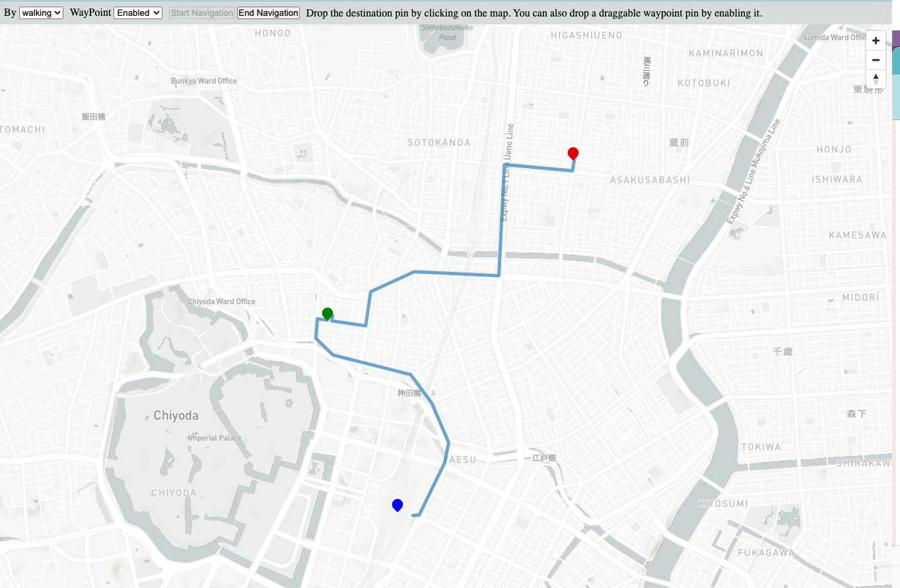
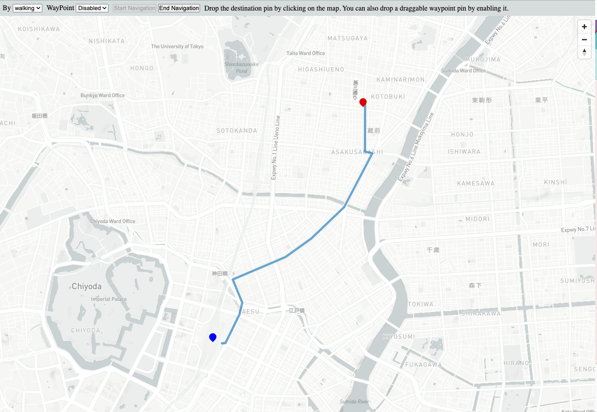

# Setup 

1. Get your own mapbox account.
   https://account.mapbox.com/auth/signup/
2. Create .env.local file at the roof of this repository.
   ```dotenv
    NEXT_PUBLIC_MAP_BOX_TOKEN=YOUR_TOKEN
   ```
3. npm run dev

# How to use

## Get route without a waypoint

1. Drop your destination pin by click on the map.
2. Click "Start Navigation"

## Get route with a waypoint

1. Drop your destination pin by click on the map.
2. Click "Start Navigation"
